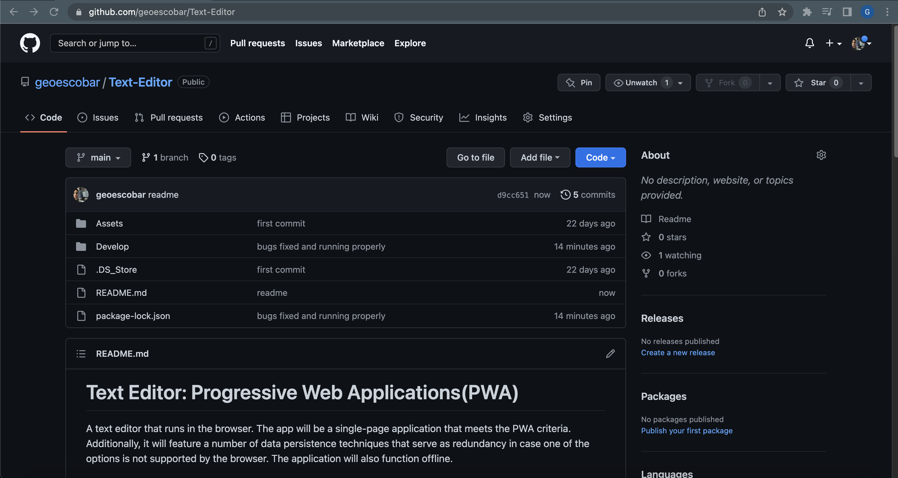
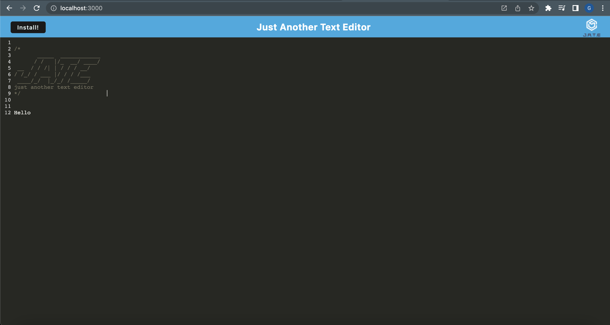

# Text Editor: Progressive Web Applications(PWA)

A text editor that runs in the browser. The app will be a single-page application that meets the PWA criteria. Additionally, it will feature a number of data persistence techniques that serve as redundancy in case one of the options is not supported by the browser. The application will also function offline.

## License


---

## Table of Contents:

- [License](#license)
- [Technologies](#technologies)
- [Installation](#installation)
- [Application](#application)
- [Contact](#contact)

---

## Technologies:

- Node
- CSS
- HTML
- JavaScript
- Express.Js

---

## Installation

##### This is a Node.Js based application. You can run the application using your integrated terminal.

1. Clone repo from GitHub

```
gh repo clone geoescobar/Text-Editor
```

2. Install required NPM packages

```
npm run install
```

3. Start the application

```
npm run start:dev
```

---

## Application

#### [Github Repo](https://github.com/geoescobar/Text-Editor)



#### [Demo](https://limitless-hollows-92081.herokuapp.com/)



---

## Contact

##### If you have any questions about this repo or want to send a message my contact info is below!

- https://github.com/geoescobar
- geo.escobar214@gmail.com
